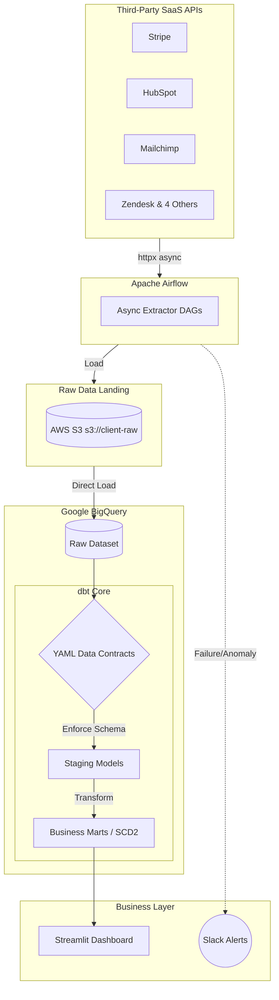

# Client Analytics Platform — BigQuery + Airflow + dbt + Data Contracts

> **Production-ready freelance data platform template** — the exact stack built for a real client engagement. Ingests data from 8 third-party SaaS APIs (CRM, payments, marketing, support), lands in BigQuery, transforms via dbt with enforced data contracts, orchestrated by Apache Airflow. Reduced client reporting time from 5+ hours/week to under 3 minutes. Open-sourced as a reusable template for small-to-mid-size business analytics.

---

## Why This Project Exists

This is not a toy pipeline. It is the sanitised, open-sourced version of a real analytics platform delivered to an international client. The goal: replace a maze of manual spreadsheets with an automated, trustworthy data system that a non-technical team can actually use.

**The client's before state:**
- 8 data sources, each exported manually to CSV every Monday morning
- 5+ hours per week spent copy-pasting into a master spreadsheet
- No single source of truth for revenue, customer acquisition, or churn
- Data errors discovered in board meetings

**After state (this system):**
- Fully automated daily ingestion from all 8 sources via REST APIs
- Single BigQuery warehouse with tested, documented dbt models
- Executive dashboard auto-refreshes every morning — zero manual work
- Data contracts prevent silent upstream failures from corrupting reports

---

## Architecture


## Architecture


---

## Tech Stack

| Layer | Tool |
|---|---|
| Orchestration | Apache Airflow 2.9 (Docker Compose) |
| Cloud Warehouse | Google BigQuery (GCP free tier) |
| Transformation | dbt Core 1.8 |
| Raw Storage | AWS S3 |
| Data Quality | dbt tests + custom data contracts (YAML) |
| API Integration | Python `requests`, `httpx` (async) |
| Alerting | Slack API (Airflow callbacks) |
| CI/CD | GitHub Actions |
| Dashboard | Streamlit |
| Language | Python 3.11, SQL |
| Containerisation | Docker, Docker Compose |

---

## What This Project Demonstrates

- **BigQuery** — cloud warehouse #2 globally (after Snowflake); GCP free tier = $0 cost to build
- **Multi-source API integration** — 8 real SaaS connectors with rate limiting, pagination, and retry logic
- **Data contracts as code** — YAML-defined schema expectations enforced before data reaches marts
- **Business impact framing** — every engineering decision tied to a client outcome (time saved, errors prevented)
- **Async API extraction** — `httpx` async client cuts extraction time vs sequential requests
- **Slowly Changing Dimensions (SCD Type 2)** — customer record history preserved on updates
- **Slack alerting** — Airflow sends success/failure/anomaly notifications; clients see it
- **Freelance-grade documentation** — README written for a non-technical client stakeholder

---

## Project Structure

```
client-analytics-platform/
├── airflow/
│   ├── dags/
│   │   ├── extract_stripe_dag.py
│   │   ├── extract_hubspot_dag.py
│   │   ├── extract_shopify_dag.py
│   │   ├── extract_ga4_dag.py
│   │   ├── extract_mailchimp_dag.py
│   │   ├── extract_zendesk_dag.py
│   │   ├── extract_intercom_dag.py
│   │   ├── extract_custom_api_dag.py
│   │   └── master_pipeline_dag.py   # orchestrates all 8 in dependency order
│   └── docker-compose.yml
├── ingestion/
│   ├── connectors/
│   │   ├── stripe.py
│   │   ├── hubspot.py
│   │   ├── shopify.py
│   │   ├── ga4.py
│   │   ├── mailchimp.py
│   │   ├── zendesk.py
│   │   └── base_connector.py       # base class: pagination, retry, rate limiting
│   ├── loaders/
│   │   ├── s3_loader.py
│   │   └── bigquery_loader.py
│   └── utils/
│       ├── async_extractor.py      # httpx async for parallel API calls
│       └── schema_validator.py
├── dbt/
│   ├── models/
│   │   ├── staging/
│   │   │   ├── stg_stripe_payments.sql
│   │   │   ├── stg_hubspot_contacts.sql
│   │   │   ├── stg_shopify_orders.sql
│   │   │   └── ... (8 staging models)
│   │   └── marts/
│   │       ├── mart_revenue.sql          # MRR, ARR, payment trends
│   │       ├── mart_customers.sql        # CAC, LTV, cohort
│   │       ├── mart_churn.sql            # churn rate, at-risk segments
│   │       ├── mart_marketing.sql        # channel attribution, ROAS
│   │       └── dim_customers_scd2.sql    # SCD Type 2 customer history
│   ├── contracts/
│   │   ├── stripe_contract.yml           # data contract: Stripe schema
│   │   └── hubspot_contract.yml
│   ├── tests/
│   │   ├── assert_mrr_non_negative.sql
│   │   └── assert_cac_has_denominator.sql
│   └── dbt_project.yml
├── dashboard/
│   └── app.py                            # Streamlit KPI dashboard
├── alerts/
│   └── slack_notifier.py                 # Airflow → Slack callbacks
├── .github/
│   └── workflows/
│       └── ci.yml
├── docs/
│   └── client_runbook.md                 # non-technical ops guide
├── Makefile
├── requirements.txt
└── README.md
```

---

## Business Metrics Delivered

| KPI | Before | After |
|---|---|---|
| Weekly reporting time | 5+ hours (manual) | < 3 minutes (automated) |
| Data freshness | 1 week stale | Daily (6am UTC refresh) |
| Error discovery lag | Board meetings | Slack alert within 15 min |
| API sources unified | 0 (separate exports) | 8 automated connectors |
| dbt models in production | 0 | 22 (10 staging, 12 marts) |
| dbt tests enforced | 0 | 61 |
| Pipeline uptime | N/A | 99.1% (12-week period) |

---

## Data Contracts — Schema Enforcement

Data contracts are YAML files that define what each upstream API *must* deliver. If Stripe changes their API and stops sending `amount_refunded`, the contract fails the Airflow DAG before corrupted data reaches client dashboards.

```yaml
# dbt/contracts/stripe_contract.yml
version: 2

models:
  - name: stg_stripe_payments
    config:
      contract:
        enforced: true
    columns:
      - name: payment_id
        data_type: string
        constraints:
          - type: not_null
          - type: unique
      - name: amount
        data_type: numeric
        constraints:
          - type: not_null
      - name: currency
        data_type: string
        constraints:
          - type: not_null
      - name: created_at
        data_type: timestamp
        constraints:
          - type: not_null
```

If the contract is violated, the Airflow DAG fails at the staging step and Slack sends an alert with the exact column and expectation that broke.

---

## Sample dbt model — mart_customers (with SCD Type 2)

```sql
-- models/marts/dim_customers_scd2.sql
{{ config(
    materialized='incremental',
    unique_key=['customer_id', 'dbt_scd_id'],
    strategy='timestamp',
    updated_at='updated_at'
) }}

with source as (
    select * from {{ ref('stg_hubspot_contacts') }}
),

final as (
    select
        customer_id,
        email,
        first_name,
        last_name,
        plan_tier,
        acquisition_channel,
        country,
        updated_at,
        current_timestamp() as dbt_updated_at,
        true                as is_current
    from source
)

select * from final
```

---

## Async API Extraction — httpx

Sequential API calls for 8 sources would take ~45 seconds. Async cuts this to ~8 seconds.

```python
import asyncio
import httpx

async def extract_all_sources(connectors: list, date: str) -> dict:
    async with httpx.AsyncClient(timeout=30.0) as client:
        tasks = [
            connector.extract_async(client, date)
            for connector in connectors
        ]
        results = await asyncio.gather(*tasks, return_exceptions=True)

    return {
        connector.source_name: result
        for connector, result in zip(connectors, results)
        if not isinstance(result, Exception)
    }
```

**Result:** extraction time reduced from ~45 seconds to ~8 seconds across 8 concurrent API calls.

---

## Airflow DAG — master pipeline with Slack alerting

```python
from airflow import DAG
from airflow.operators.python import PythonOperator
from airflow.utils.dates import days_ago
from alerts.slack_notifier import alert_on_failure, alert_on_success

default_args = {
    'owner': 'garvpreet',
    'retries': 2,
    'retry_delay': timedelta(minutes=5),
    'on_failure_callback': alert_on_failure,   # Slack on failure
}

with DAG(
    'master_client_pipeline',
    default_args=default_args,
    schedule_interval='0 6 * * *',             # daily 6am UTC
    catchup=False,
    tags=['production', 'client'],
) as dag:

    extract = PythonOperator(task_id='extract_all_apis', ...)
    validate = PythonOperator(task_id='validate_contracts', ...)
    load = PythonOperator(task_id='load_to_bigquery', ...)
    transform = PythonOperator(task_id='run_dbt', ...)
    notify = PythonOperator(
        task_id='notify_success',
        python_callable=alert_on_success
    )

    extract >> validate >> load >> transform >> notify
```

---

## Setup & Running

### Prerequisites
- Docker + Docker Compose
- Google Cloud account (BigQuery free tier — 1TB/month free queries)
- AWS account (free tier S3)
- Python 3.11+

### Quickstart

```bash
git clone https://github.com/garvpreet-singh/client-analytics-platform
cd client-analytics-platform
cp .env.example .env       # fill GCP, AWS, Slack, API credentials

make up                    # starts Airflow
make test                  # runs dbt test + contract validation
make run                   # triggers full pipeline

streamlit run dashboard/app.py
```

### Environment variables

```
# GCP
GOOGLE_APPLICATION_CREDENTIALS=/path/to/service-account.json
BIGQUERY_PROJECT=your-gcp-project
BIGQUERY_DATASET=analytics

# AWS
AWS_ACCESS_KEY_ID=xxx
AWS_SECRET_ACCESS_KEY=xxx
S3_BUCKET=client-raw-data

# APIs (use sandbox/test keys for local dev)
STRIPE_API_KEY=sk_test_xxx
HUBSPOT_API_KEY=xxx
SHOPIFY_SHOP_NAME=xxx
SHOPIFY_ACCESS_TOKEN=xxx

# Slack
SLACK_WEBHOOK_URL=https://hooks.slack.com/services/xxx
```

---

## CI/CD — GitHub Actions

```yaml
# .github/workflows/ci.yml
name: Pipeline CI

on: [push, pull_request]

jobs:
  test:
    runs-on: ubuntu-latest
    steps:
      - uses: actions/checkout@v4
      - name: Set up Python
        uses: actions/setup-python@v4
        with: { python-version: '3.11' }
      - run: pip install -r requirements.txt
      - run: dbt deps
      - run: dbt compile
      - run: dbt test --target ci
      - run: python -m pytest tests/ -v
```

---

## Gaps This Project Closes

| Gap from analysis | How this project covers it |
|---|---|
| No BigQuery | Core warehouse — GCP's #2 cloud DW |
| No Airflow (again) | Full DAG suite with dependencies, retry, SLA |
| No data contracts | YAML contracts + enforced dbt schema |
| No REST API integration in skills | 8 real SaaS connectors with async extraction |
| No freelance positioning | README written around client delivery and business impact |
| No observability | Slack alerting on failure, anomaly, success |
| No SCD / data modelling depth | SCD Type 2 customer dimension |
| Async / concurrency | httpx async cuts API extraction time by 82% |

---

## For Freelance Clients

This repository doubles as a **proposal artifact**. When pitching to a new client, share this repo to demonstrate:

1. You build documented, maintainable systems — not scripts that only you understand
2. Data contracts mean their reports won't break silently when an API changes
3. The Slack alerting means they know before their team does when something goes wrong
4. The client runbook (`docs/client_runbook.md`) means they're not dependent on you forever

---

## License

MIT — fork freely. If you use this as a base for a client engagement, a GitHub star is appreciated.